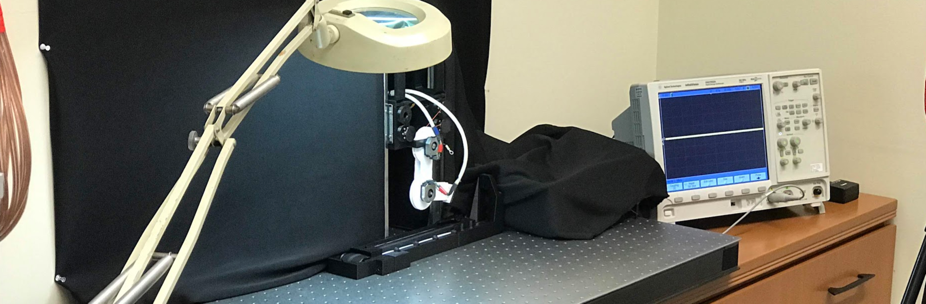

# Companion Website
*Prepared by: Brian A. Cohn*

## Nature Machine Intelligence - March 2019
### **Abstract:**
TBD

# [Article: Nature.com](nature.com)
# [Free-Access PDF: Arxiv Preprint ](https://arxiv.org/pdf/1810.08615.pdf)

### Have comments or questions about how to apply these methods to your work?
We'd be happy to help. Send us a message: marjanin@usc.edu

# Code to run the experiment 
[Machine Learning Code: marjanin/Marjaninejad-et-al-2019-NMI](https://github.com/marjanin/Marjaninejad-et.-al.-2019-NMI)